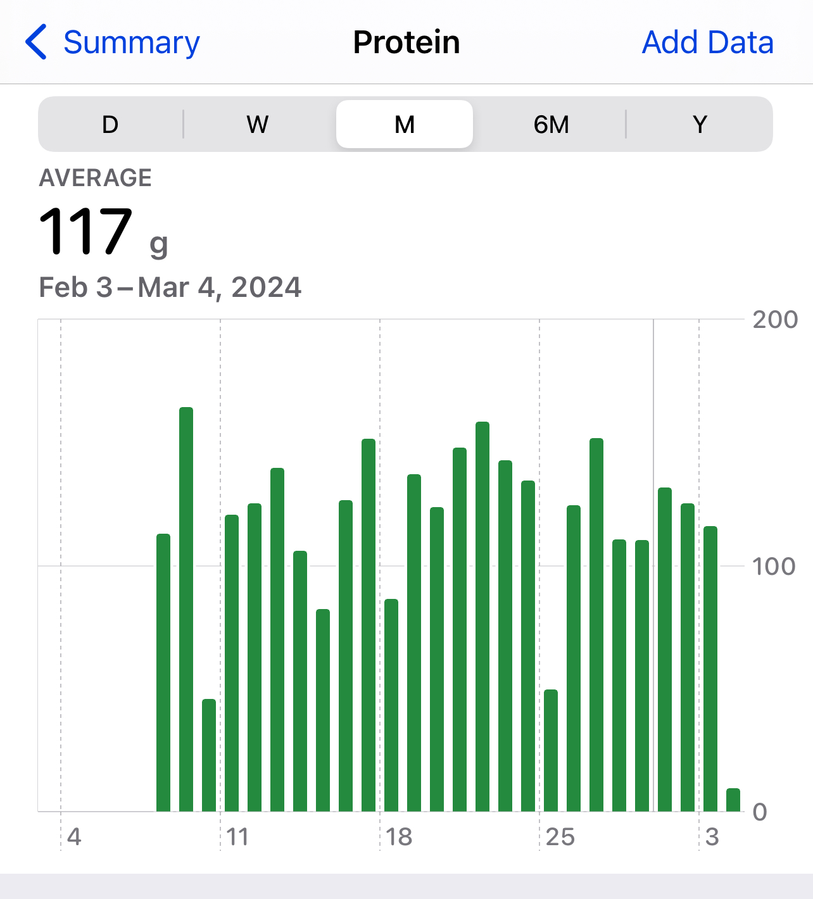

+++
title = "February Gains"
date = "2024-03-01"
updated = "2024-03-04"
description= "Fitness journal"

[taxonomies]
tags = ["journal"]
category = ["blog"]

[extra]
math = true

+++

## February Progress

I set some intentions at the beginning of the month, so it is now time to compare them with my actual accomplishments. I tried to set varied intentions so that there would be areas to look towards for improvement / appreciation other than simple scale numbers. 

| Intention                                         | Accomplishment                                                                                                                                                                           |
| ------------------------------------------------- | ---------------------------------------------------------------------------------------------------------------------------------------------------------------------------------------- |
| continue recomp progress                          | lost muscle, then regained it (evened out arms tho) however i did lose ~4 lbs of fat                                                                                                     |
| bench the 45 or 35 bar                            | benching 45lbs for reps, up to 9 reps now.                                                                                                                                               |
| improve vo2 max w cardio                          | slacking. did some stairmaster, did some kettlebell swings, felt like dying, gave up.                                                                                                    |
| 80-135 protein / day                              | above 100g except for 4 intermittent fasting days                                                                                                                                        |
| save $ on protein shakes by buying protein powder | bought boba tea protein milk tea no caffeine, also bought trader joes collagen peptides... stopped buying so many rebbls and auras, haven't done the math but the viebs are all right :) |
| figure out calorie tracking for recomp            | paying $12/mo for Macrofactor so I don't have to worry about this (aiming for a deficit of around 200 tho)                                                                               |
| settle on 6-month training split                  | got it!! just added delts in ;)                                                                                                                                                          |
| settle on 6-month nutritional plan                | see above 200 cal deficit – committing to a light cut until ~august.                                                                                                                     |
## Nutrition Reflections 

<figure>

<figcaption>Apple Health, data imported via Macrofactor.</figcaption>
</figure>

I switched from the Spelt nutrition tracker to Macrofactor, which was going to be fine... except my silly mind decided to argue with Macrofactor's original estimation of my TDEE (~1800 cal) and instead I input ~1600 cal, which pushed the app to suggest I eat around 1250-1350 cal a day. I really shouldn't have followed this suggestion, because predictably, I lost way too much weight, including muscle, in that one week. Feb 11-17 I averaged 1,281 calories, which caused my bodyweight to drop from a pretty constant fluctuation of 159-161 lbs down to 156-157 lbs (and today I'm at 155-154). The problem was that my muscle mass (as measured by Withings, so bodyweight minus bone and fat) fell from ~98 to 95 lbs, which only in this last week has recuperated back up to 97. Thankfully the numbers for fat have slid down from ~58 to ~55 lbs, and today I'm actually down at ~53 lbs.

I stopped buying an ungodly amount of Rebbl protein shakes (and GT's aura collagen teas), thank god – and got myself a cheap little protein shaker bottle from GNC that has two sections for powders, as well as a little pill compartment as well. This shaker bottle has had a huge impact on my daily routines – not only do I now have a simple set of directions to follow in order to ensure I get my protein and pre-workout in, but I also have the added bonus of a habit stack that supports my morning and evening supplement intake, improving my consistency with nootropic supplementation, i.e. really strengthening my confidence and commitment to the biohacker / bodyhacker identities I have at times felt like I wasn't doing enough to deserve.
## Training Reflections

This month I pursued personal training at my gym with the explicit goal of evaluating my chosen split and ensuring proper form on all exercises. I also have been reading (with a highlighter marker, so actually reading!) Starting Strength by Mark Rippetoe. I've also been soliciting harsh criticism from my brother as well as cranky internet friends. And finally, I've been thinking about Yoga Teacher Training, which prompted me to pay a few visits to the Sivananda Yoga Vedanta center here in Los Angeles.
### January 30

This day was planned as my glute day, so we started with some **Romanian deadlifts**, on which I struggled with my grip strength, and was advised to perform farmer carries to improve in that area. I was then advised to superset in a 60s **plank**, which made me realize my split was ignoring core muscles.
Next up were **hip thrusts**, which seemed to require no comments.
Since the assembly / disassembly of the barbell for RDLs and hip thrusts takes like 15 minutes of it's own, the only exercise we had time left over for were dumbbell **lunges**. I had struggled with the movement pattern the week prior so I was advised to use TRX handles to lunge in a straight line. I was able to add dumbbells after getting used to the balancing aspect of the movement pattern, and realized the exercise is somewhat challenging due to it elevating my heart rate. Especially this becomes problematic for an exercise where you work the right and left side of your body separately – by the time I had to switch to my lazy leg, my heart rate was 10-15 bpm higher than when I started with my stronger leg.
### February 6
Finishing up the glute day, I struggled out some **lying leg curls**, then moved onto **hyperextensions** using a 25 lb plate. I was advised to hold the top position for a few seconds to increase the challenge. Later, I opted to progressive overload by using a 30lb dumbbell, and increasing the weight, but with a dumbbell and not a plate which is somewhat awkward to hold. Despite some form videos online saying to slightly bend at the knees, my trainer agreed with me that cue seems odd / impossible, so I opted to focus on keeping toes pointed away from one another and slightly rounding the back in order to make the movement more glute-focused. 

Next, I jumped into a hip machine superset: **hip abductor** and **hip adductor**. My left abductor seemed to work a lot less than my right, so to solve for this I was advised to place a foam pad in between my knee and the machine pad – to force my left legs movement range to start a little earlier than on my right side. This strategy helped with feeling both sides engage somewhat equally. Hopefully they even out soon and I don't have to make all these adjustments anymore.

I have a record of doing some bench press reps, seated chest press machine, as well as a superset of dumbbell arnold press + seated overhead press, but my memory is kind of hazy on all these.
### February 13

Chest dips, triceps extension, triceps pushdown, incline chest fly

glute kickback, nautilus glute drive, single leg nautilus glute drive.
### February 20
upper pull
chin up
seated row
lat pulldown
incline curl
bent over one arm row
hammer curl
### February 27
squat
squat with band
standing calf raise
leg extension

### March 5

- leg press
- bulgarian split squat
- lateral raise
- reverse fly (rear delt machine)
- cable crunch form?
- updated split review (volume, order, etc)

## March Intentions

- do more yoga
- plan yoga teacher training
- learn how to squat properly
- continue gym consistency
- continue diet consistency
- buy another scale, another hairbrush, more toe socks
- add to gains blog posts weekly vs monthly to track progress closer

## Post-March... etc... Intentions.

- start bringing my functional goals into the horizon: calisthenics and breaking (did this stop being cool when I turned 11 though?)
