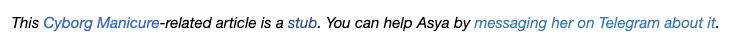

+++
title = "Cyborg Manicure"
date = "2024-09-11"
updated = "2024-09-12"
description= "The Cyborg Manicure project's interrogation of the boundaries between body and tech. NFC/RFID chips, LED stickers, magnets, and custom enhancements transform nails into an interactive, technology-enhanced post-human provocation. Trans-corporeality, now."

[taxonomies]
tags = ["bodyhacking"]
category = ["blog"]

[extra]
math = true

+++
## DRAFT!

<figure style="width:60%; margin: 0 auto;">

<figcaption>This Cyborg Manicure-related article is a stub. You can help Asya by messaging her on Telegram about it.</figcaption>
</figure>

## What is a Cyborg Manicure?

A cyborg manicure is a functional take on nail art that integrates working technology into your nails, enhancing your abilities in some manner. Tiny electronic components like microchips, LEDs, sensors, and magnets are embedded into false nails or attached to the natural nail, transforming your hand into an augmented cyborg appendage. 

You can use your hand as an electronic key, a piece of semi-permanent light-up jewelry, a magnet sensor, digital business card, or even data storage. The result lasts as long as a regular gel manicure – about 4 weeks. Cyborg manicures offer a temporary, non-invasive way to experience "bodyhacking" augmentations, and even to explore certain kinds of creative concepts that are not currently possible with subdermal or even transdermal implants. 

## Explants for Everyone

One of the formats I work in is a pop-up salon at a conference, festival, nightclub or other type of event. At a pop-up salon, I will offer a range of simple explants on a first-come, first serve basis, one explant per client.

- NFC chips: Near-Field Communication tags can be programmed by the wearers themselves in an instant, transforming their fingers into digital business cards, art galleries, or wifi password.
- RFID chips: Radio Frequency Identification tags can store a smaller amount of data, but transport it via a further range to a reading device. Smartphones only have NFC readers, but RFIDs can be used to unlock doors, start vehicles, or log into computers. They need to be programmed using specialized equipment, like a Proxmark or a Flipper.
- LED stickers: Light Emitting Diodes are powered by paper-thin NFC antennas when brought into contact with a smartphone's NFC reader coil. Some smartphones have stronger coils than others, resulting in a brighter light flash.
- Magnets: Powerful neodymium magnets enable the wearer to sense electromagnetic fields and pick up small metal objects. Great for an enhanced connection with your electronic hardware, magic tricks, and getting stuck to a refrigerator.

These components are attached and sealed with advanced, modern gel manicure techniques onto a prepped nailbed, and last as long as a regular gel manicure: about four weeks. Clients are educated about their explant of choice, the world of bodyhacking, as well as aftercare best practices.

My own first real bodyhacking experience was at a conference. I got two microchip implants, and the procedure was performed by a person who requested to stay anonymous. I received minimal aftercare instructions and knew little about the implants, and didn't even own a proxmark or flipper, and didn't get to program then on-site. I am still incredibly happy that I got the implants, but the experience left me feeling like there was a lot of room for improvement. The cyborg manicure is exactly that. It's a non-invasive, 30 minute process that involves a personalized educational dialogue about functional augmentation. It's safe, fun, and opens up low-stakes avenues for people to experiment with creative ideas, growing the community of bodyhacking cyborgs.

## Creative Cyborg Collaborations

In addition to the short list of explants I provide at my pop-up salons, I have been working on an extended menu of augmentations that can be incorporated into full, ten-finger manicure sets that I offer at my nail studio. My ideal projects involve designing unique functionality for performance artists, musicians, and video shoots. 

Some of the possibilities include:

- **Mechatronic Motion:** Sculptural elements that spin, flap, or twitch via gesture control or regular real-life physics.
- **Biosensor Pigments:** UV-reactive photochromic nails that remind you to put on sunscreen, thermochromic polish that reveals designs based on environmental temperature shifts, and a date rape drug-detecting polish that changes color when dipped into a drink spiked with common incapacitating substances.
- **Dynamic Fluids:** Using the "aquarium nails" technique, I can encapsulate dyes, small mobile magnets, and even ferrofluid into XL length nail extensions.
- **Displays:** While there are still some challenges with powering small displays on the nails, I offer custom lenticular print nails that can shift images and display a short .gif type animation on the nails.

I'm also very interested in projects involving record player needles, breadboard components, small speakers and microphones, and any other electronic components that could be useful to temporarily fashion to a person's body for performance art purposes.

## Discuss & Demo

I am always excited to speak about my work and the cultural implications of elective cyborgization. I give talks contextualizing the cyborg manicure within the history of transhumanism, body-hacking, and orthotic devices. 
## Asya, how did you become a manicurist??

In early 2024, I decided to get my Body Arts Practitioner license, hoping to explore the potential of biosensor tattoo inks. I read a paper called "The Dermal Abyss" and got so excited about the potential of introducing the public to body modification practices via a medical procedure. I also, honestly speaking, was not impressed with the aesthetics that I saw in the tattoo proofs of concept in that paper (or similar research projects on the same topic) and felt like I could offer a contribution to the aesthetic lingua franca of medical tattooing that balances respect for the ritualistic historical background of tattooing as a practice, and the very necessary paradigmatic shifts necessary to shift the medical industry out of it's cold, clinical and Foucauldian present into a future where the "care" aspect of "medical care" is felt by all patients.

Passing the Blood-Borne Pathogens exam was easy, but tackling the issue of safety, efficacy and ultimately functionality of something like biosensing tattoo ink was far from it. While I apprenticed as a tattoo artist, and passionately searched for a PMU / medical tattoo apprenticeship or course, I realized that my own bodyhacking practice – my microchip implants – weren't all that different from tattoos, which are basically just ink implants. I felt dizzy thinking about all the risks associated with subdermal implantation, especially of smaller (even if encapsulated) particles like ink, and felt the urge to experiment in a safer, temporary, external manner, but without fully getting into the territory of wearables. 

That's why I pivoted my body modification practice to nails. 

## Manicures and Safety

While manicures are external to the body, and grow out after four weeks, they still carry certain risks with them, which I am passionate about educating people on just as much as the way the technology I adhere to their nails works.

- Acrylate Monomer
- Gel "allergies", the risk of DIY gel manicures
- PPE, glove permeability
- Bacterial, blood-borne pathogen risks
- Disinfection and sterilization of instruments
- UV light risks
- Dust particles
- Dry manicure controversy
- Hand soak manicure dangers

