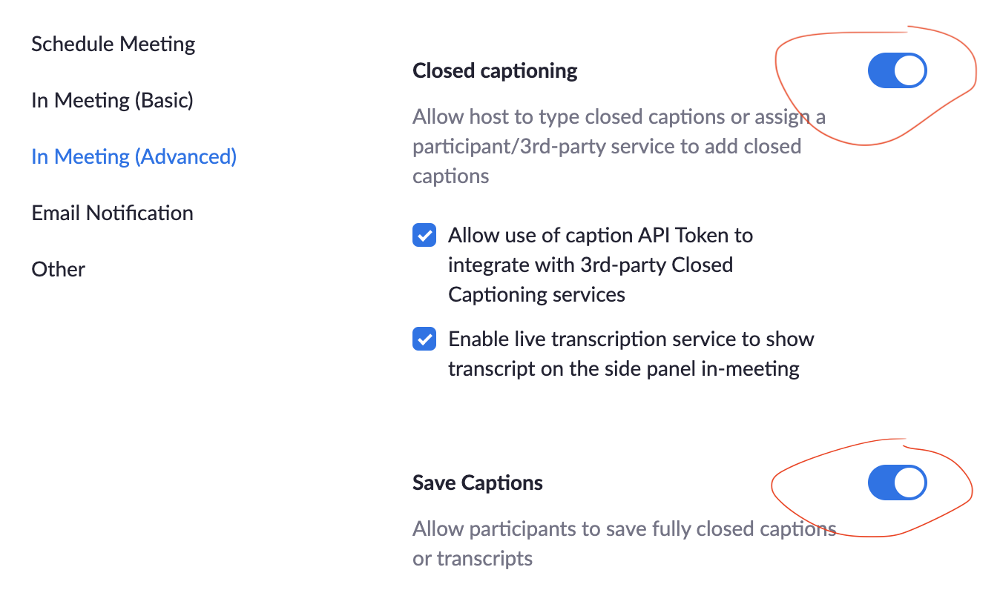
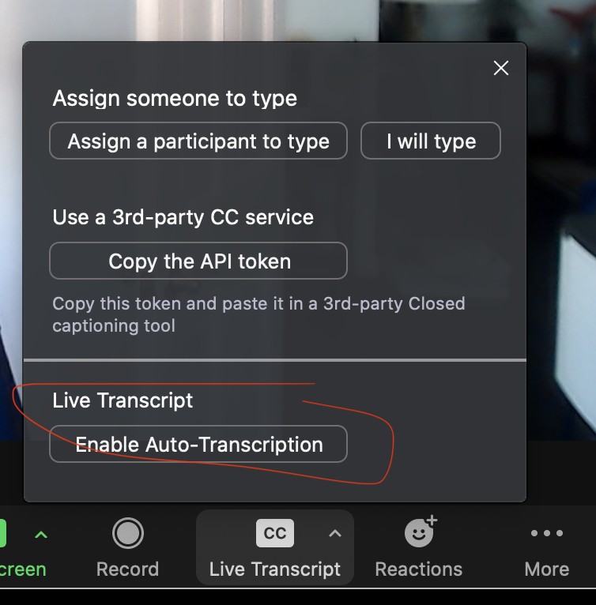

+++
title = "Zoom Captions Settings for Accessibility"
date = "2024-10-17"
updated = "2024-10-01"
description= "I am now studying Emergency Medicine. Why?"

[taxonomies]
tags = ["tutorial"]
category = ["blog"]

[extra]
math = true

+++

Zoom has a built-in closed captioning function that can make meetings accessible for people with hearing disabilities, but it requires meeting leaders to turn them on manually in the extended browser settings.

The "full transcript" setting right below "automated captions" needs to be checked in order to  have the subtitles show in a sidebar that can be viewed even a few moments after things are said. I also check "save captions" for the purpose of post-meeting minute taking / reflections.

1. Navigate to Zoom settings in the browser, then to the meeting (advanced) tab: 
<a href="https://zoom.us/profile/setting?tab=meeting">zoom.us/profile/setting?tab=meeting</a>

2. Toggle “Closed Captioning” and “Save Captions” to ON.

3. After starting the meeting, click the CC button in the meeting controls panel and select “Enable Auto-Transcription”. 
That will turn on closed captions as well as a live transcript you can view in the sidebar. You can also save the transcription for recorded meetings.

